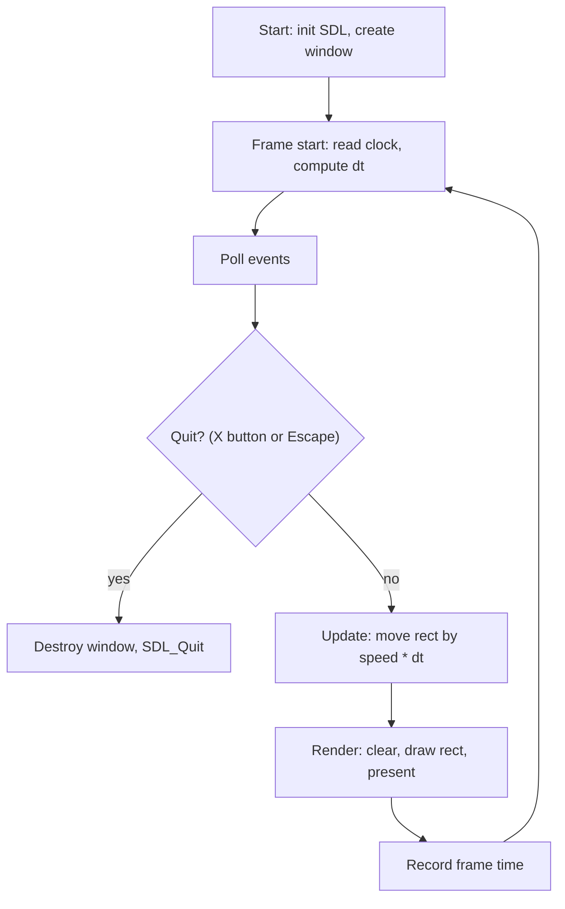

flowchart LR
    A[Start] --> B{Renders?}
    B -- yes --> C[Mermaid works]
    B -- no --> D[Raw code block]
    C --> E[Use it for devlogs]
    D --> E

## Game loop (game 0)

```mermaid
flowchart TD
    A["Start: init SDL, create window"] --> B["Frame start: read clock, compute dt"]
    B --> C["Poll events"]
    C --> D{"Quit? (X button or Escape)"}
    D -- yes --> E["Destroy window, SDL_Quit"]
    D -- no --> F["Update: move rect by speed * dt"]
    F --> G["Render: clear, draw rect, present"]
    G --> H["Record frame time"]
    H --> B
```

## Something else
